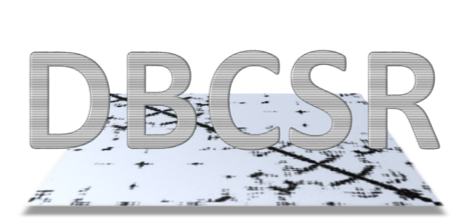

# DBCSR: Distributed Block Compressed Sparse Row matrix library

[](https://travis-ci.org/cp2k/dbcsr) [](https://codecov.io/gh/cp2k/dbcsr)
[](./LICENSE)
[](https://github.com/cp2k/dbcsr/releases)

DBCSR is a library designed to efficiently perform sparse matrix matrix multiplication, among other operations.
It is MPI and OpenMP parallel and can exploit Nvidia and AMD GPUs via CUDA and HIP.

<p align="center">

</p>

## Prerequisites

You absolutely need:

* GNU make
* a Fortran compiler which supports at least Fortran 2008 (including the TS 29113 when using the C-bindings)
* a LAPACK implementation (reference, OpenBLAS-bundled and MKL have been tested. Note: DBCSR linked to OpenBLAS 0.3.6 gives wrong results on Power9 architectures.)
* a BLAS implementation (reference, OpenBLAS-bundled and MKL have been tested)
* a Python version installed (2.7 or 3.6+ have been tested)

Optionally:

* [libxsmm](https://github.com/hfp/libxsmm) (1.8.2+ with make-only, 1.10+ with cmake) for Small Matrix Multiplication acceleration
* [CMake](https://cmake.org/) (3.10+)

To build [libsmm_acc](src/acc/libsmm_acc/) (DBCSR's GPU backend), you further need:

* A GPU-capable compiler, either
  * CUDA Toolkit (targets NVIDIA GPUs, minimal version required: 5.5)
  * or HIP compiler (targets NVIDIA or AMD GPUs)
* a C++ compiler which supports at least C++11 standard

We test against GNU and Intel compilers on Linux systems, GNU compiler on MacOS systems.

## Getting started

Download either a release tarball or clone the latest version from Git using:

    git clone --recursive https://github.com/cp2k/dbcsr.git

Run

    make help

to list all possible targets.

Update the provided [Makefile.inc](Makefile.inc) to fit your needs
(read the documentation inside the file for further explanations) and then run

    make <target>

Some examples on how to use the library (which is the only current documentation) are available under the examples directory (see [readme](examples/README.md)).

## C/C++ Interface

You can compile with

    make CINT=1

to generate the C interface. Make sure your Fortran compiler supports F2008
standard (including the TS) by updating the flag in the Makefile.inc.

## CMake

Building with CMake is also supported:

    mkdir build
    cd build
    cmake ..

The configuration flags are (default first):

    -DUSE_MPI=<ON|OFF>
    -DUSE_OPENMP=<ON|OFF>
    -DUSE_SMM=<blas|libxsmm>
    -DUSE_CUDA=<OFF|ON>
    -DUSE_CUBLAS=<OFF|ON>
    -DUSE_HIP=<OFF|ON>
    -DUSE_HIPBLAS=<OFF|ON>
    -DWITH_C_API=<ON|OFF>
    -DWITH_EXAMPLES=<ON|OFF>
    -DWITH_GPU=<P100|K20X|K40|K80|V100|Mi50>
    -DTEST_MPI_RANKS=<auto,N>
    -DTEST_OMP_THREADS=<2,N>
    -DCMAKE_BUILD_TYPE=<Release|Debug|Coverage>

For build recipes on different platforms, make sure to also read the [INSTALL.md](INSTALL.md).

If you want to use Python from a virtual environment and your CMake version is < 3.15, specify the desired python interpreter manually using:

    -DPython_EXECUTABLE=/path/to/python

## Workaround issue in HIP

HIP is a relatively new language, and some issues still need to be ironed out. As a workaround to an [issue](https://github.com/ROCm-Developer-Tools/HIP/pull/1543) in HIP's JIT infrastructure, please set the following if you've built HIP from source:

    export HIP_PATH=/opt/rocm/hip

before running on an AMD GPU.

## Using DBCSR in a CMake project

We are providing CMake helper files to easily include DBCSR in any other CMake-based project.
For this you have to build DBCSR using CMake as described above and then also install it.

As a user being able to run commands as root, use:

    sudo make install  # will install to /usr/local

if you can not run commands as root, use the following to add a custom prefix to the installation:

    make DESTDIR=/my/dbcsr/install/location install


In your project's CMake you can then easily search for the DBCSR library:

```cmake
cmake_minimum_required(VERSION 3.10)

enable_language(Fortran C CXX)  # only request the required language

find_package(DBCSR 2.0.0 CONFIG REQUIRED)
find_package(MPI)

# for Fortran:
set(CMAKE_Fortran_FLAGS "-std=f2003")  # your Fortran code likely needs to be F2003+ compatible as well
add_executable(dbcsr_example_fortran dbcsr_example.f90)
target_link_libraries(dbcsr_example_fortran DBCSR::dbcsr)

# for C:
add_executable(dbcsr_example_c dbcsr_example.c)
target_link_libraries(dbcsr_example_c DBCSR::dbcsr_c MPI::MPI_C)

# for C++:
add_executable(dbcsr_example_cpp dbcsr_example.cpp)
target_link_libraries(dbcsr_example_cpp DBCSR::dbcsr_c MPI::MPI_CXX)
```

If you installed DBCSR into a custom prefix, you have to make sure that `cmake`
is able to find the `DBCSR` CMake configuration:

    CMAKE_PREFIX_PATH=/my/dbcsr/install/location/usr/local/lib/cmake cmake ..

## API documentation

To build the API documentation you need [FORD](https://github.com/Fortran-FOSS-Programmers/ford).

Afterwards use the `doc` target for the CMake generated Makefile:

    mkdir build
    cd build
    cmake ..  # will look for the `ford` binary
    make doc

The documentation (HTML format) will be located in `doc/`.

## Supported compilers

DBCSR uses the Fortran 2008+ standard, which requires up-to-date compilers.
Currently direct testing is done with the following compilers:

* GNU 5.4.0, 8.3.0
* Intel 19.0.1.144

Since DBCSR is a core library of CP2K, the code gets additional testing on a
wider range of systems and compilers, you can find more information about this
on [CP2K Compiler Support](https://www.cp2k.org/dev:compiler_support).

## Contributing to DBCSR

Your contribution to the project is welcome!
Please see [Contributing.md](./CONTRIBUTING.md) and this [wiki page](https://github.com/cp2k/dbcsr/wiki/Development). For any help, please notify the other developers.
