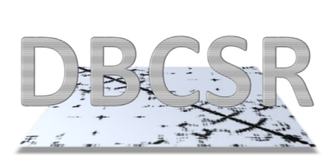

# DBCSR: Distributed Block Compressed Sparse Row matrix library 

 

DBCSR is a library designed to efficiently perform sparse matrix matrix multiplication, among other operations.
It is MPI and OpenMP parallel and can exploit GPUs via CUDA.

## Prerequisites

You absolutely need:

* GNU make
* a Fortran compiler which supports at least Fortran 2003 (respectively 2008+TS when using the C-bindings)
* a LAPACK implementation (reference, OpenBLAS-bundled and MKL have been tested)
* a BLAS implementation (reference, OpenBLAS-bundled and MKL have been tested)
* a Python version installed (2.7 or 3.6+ have been tested)

Optionally:

* [libxsmm](https://github.com/hfp/libxsmm) (1.8.2+ with make-only, 1.10+ with cmake) for Small Matrix Multiplication acceleration
* [CMake](https://cmake.org/) (3.10+)

To build with CUDA support you further need:

* CUDA Toolkit
* a C++ compiler which supports at least C++11 standard

We test against GNU and Intel compilers on Linux systems.

## Getting started

Download either a release tarball or clone the latest version from Git using:

    git clone --recursive https://github.com/cp2k/dbcsr.git

Run

    make help

to list all possible targets.

Update the provided [Makefile.inc](Makefile.inc) to fit your needs 
(read the documentation inside the file for further explanations) and then run

    make <target>

Some examples on how to use the library (which is the only current documentation) are available under the examples directory (see [readme](examples/README.md)).

## C/C++ Interface

You can compile with

    make CINT=1

to generate the C interface. Make sure your Fortran compiler supports F2008
standard (including the TS) by updating the flag in the Makefile.inc.

## CMake

Building with CMake is also supported:

    mkdir build
    cd build
    cmake ..
    
The configuration flags are (default first):

    -DUSE_MPI=<ON|OFF>
    -DUSE_OPENMP=<ON|OFF>
    -DUSE_SMM=<blas|libxsmm>
    -DUSE_CUDA=<OFF|ON>
    -DWITH_C_API=<ON|OFF>
    -DWITH_EXAMPLES=<ON|OFF>
    -DWITH_GPU=<P100|K20X|K40|K80>
    -DTEST_MPI_RANKS=<auto,N>

## Contributing to DBCSR
The core of DBCSR is written in Fortran. All other languages must be supported through bindings. 

There is a single [API](https://github.com/cp2k/dbcsr/blob/develop/src/dbcsr_api.F) file for DBCSR, which is provided for external usage only. **Do not use the API for any internal DBCSR development!** Packages build on top of DBCSR, for example [DBCSR Tensors](https://github.com/cp2k/dbcsr/tree/develop/src/tensors), **must only use** the DBCSR API.

We support Make and CMake for compilation, please keep the build system updated when adding/removing files. When adding new functions, it is extremely important to provide simple test programs, aka "unit tests", to check whether these functions are performing as they should. The directory [test](https://github.com/cp2k/dbcsr/tree/develop/tests) serves as infrastructure for that. If you do not feel comfortable with integrating these tests with the build system, please notify the other developers.

It is also appreciated to have examples (under the directory [examples](https://github.com/cp2k/dbcsr/tree/develop/examples)). They must be independent of the DBCSR compilation and only use the DBCSR API. 

### Fortran Code conventions

The code can be formatted with the prettify tool by running `make -j pretty`.

Please make sure that you follow the following code conventions (based on [CP2K conventions](https://www.cp2k.org/dev:codingconventions)):
1. Every `USE` statement should have an `ONLY:` clause, which lists the imported symbols.
2. Every `OMP PARALLEL` region should declare `default(none)`.
3. Every static variable should be marked with the `SAVE` attribute.
4. Every Fortran module should contain the line `IMPLICIT NONE`.
5. Every conversion that might change value should be explicit.
6. Each `.F` file should contain either a `PROGRAM` or a single `MODULE`, whose name matches the filename. Then, it should start with the DBCSR header. Note that the name of the modules must be unique, even accross different directories! 
7. Use the routines from [MPI wrappers](https://github.com/cp2k/dbcsr/tree/develop/src/mpi) instead of calling MPI directly.
8. Don't use `UNIT=*` in `WRITE` or `PRINT` statements. Instead request a unit from the logger:     `iw=dbcsr_logger_get_default_unit_nr()` and write only if you actually received a unit: `IF(iw>0) WRITE (UNIT=iw, ,,,)`.
9. Avoid to use `STOP`. Prefer the DBCSR error handlers: `DBCSR_WARN`, `DBCSR_ABORT`, `DBCSR_ASSERT`. 
10. Each preprocessor flag should start with two underscores and be documented in the [Makefile.inc](https://github.com/cp2k/dbcsr/blob/develop/Makefile.inc).

**Most important, please avoid to commit dead code and useless comments!**
