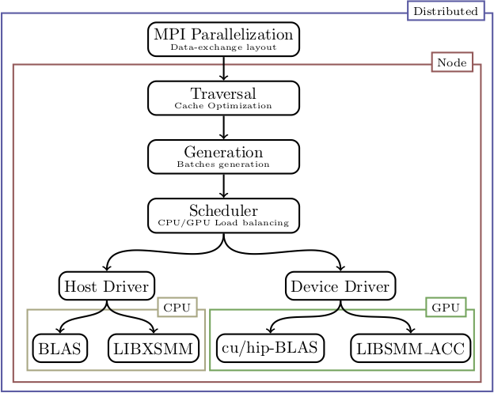
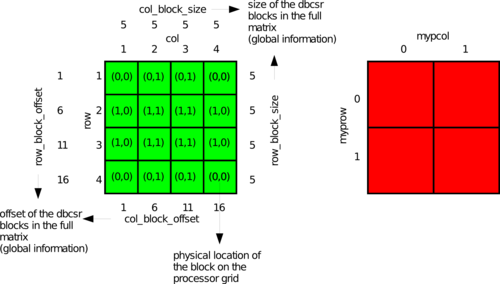

title: Overview

# Code Architecture



```
dbcsr/
-- src/
---- acc/: contains all code related to accelerators
---- base/: base routines needed to abstract away some machine/compiler dependent functionality
---- block/: block level routines
---- core/: core matrix data structure
---- data/: data handling
---- dist/: data distribution and message passing
---- mm/: matrix-matrix multiplication
---- mpi/: wrappers of the MPI routines
---- ops/: high level operations
---- tas/: tall-and-skinny matrices
---- tensors/: block-sparse tensor framework
---- utils/: utilities
---- work/
```

# Distribution Scheme

Assumed square matrix with 20x20 matrix with 5x5 blocks and a 2x2 processor grid




# List of standard compiler flags

* OpenMP flag to enable multi-threaded parallelization, e.g. `-fopenmp` for GNU and Intel compilers.
* Warnings, e.g. `-Werror=aliasing -Werror=ampersand -Werror=c-binding-type -Werror=intrinsic-shadow -Werror=intrinsics-std -Werror=line-truncation -Werror=tabs -Werror=target-lifetime -Werror=underflow -Werror=unused-but-set-variable -Werror=unused-variable -Werror=unused-dummy-argument -Werror=conversion -Werror=zerotrip -Werror=uninitialized -Wno-maybe-uninitialized` for GNU compiler.
* Error checkings (only `Coverage` and `Debug` builds), e.g. `-fcheck=all -ffpe-trap=invalid,zero,overflow -fbacktrace -finit-real=snan -finit-integer=-42 -finit-derived -Werror=realloc-lhs -finline-matmul-limit=0` for GNU compiler.

# List of Macros used in the code

| Macro | Explanation | Language |
|-|-|-|
| `__parallel` | Enable MPI runs | Fortran |
| `__USE_MPI_F08` | Enable use of the modern `mpi_f08` module instead of the `mpi` module to reduce interfacing issues | Fortran |
| `__NO_MPI_THREAD_SUPPORT_CHECK` | Workaround for MPI libraries that do not declare they are thread safe (funneled) but you want to use them with OpenMP code anyways | Fortran |
| `__MKL` | Enable use of optimized Intel MKL functions | Fortran
| `__NO_STATM_ACCESS`, `__STATM_RESIDENT` or `__STATM_TOTAL` | Toggle memory usage reporting between resident memory and total memory. In particular, macOS users must use `-D__NO_STATM_ACCESS` | Fortran |
| `__NO_ABORT` | Avoid calling abort, but STOP instead (useful for coverage testing, and to avoid core dumps on some systems) | Fortran |
| `__LIBXSMM` | Enable [LIBXSMM](https://github.com/hfp/libxsmm/) link for optimized small matrix multiplications on CPU | Fortran |
| `__ACCELERATE` | Must be defined on macOS when Apple's Accelerate framework is used for BLAS and LAPACK (this is due to some interface incompatibilities between Accelerate and reference BLAS/LAPACK) | Fortran |
| `NDEBUG`       | Assertions are stripped ("compiled out"), `NDEBUG` is the ANSI-conforming symbol name (not `__NDEBUG`). Regular release builds may carry assertions for safety | Fortran, C, C++ |
| `__CRAY_PM_ACCEL_ENERGY` or `__CRAY_PM_ENERGY` | Switch on collectin energy profiling on Cray systems | Fortran |
| `__DBCSR_ACC` | Enable Accelerator compilation | Fortran, C, C++ |
| `__OPENCL`  | Enable OpenCL acceleration | C |
| `__CUDA_PROFILING`  | To turn on Nvidia Tools Extensions. It requires to link `-lnvToolsExt` | Fortran, C, C++ |
| `__CUDA` | Enable CUDA acceleration | C, C++ |
| `__HIP`  | Enable HIP acceleration | C, C++ |
| `__DBCSR_ACC_G2G` | Enable GPU Aware MPI in CUDA and HIP backends | Fortran, C, C++ |
