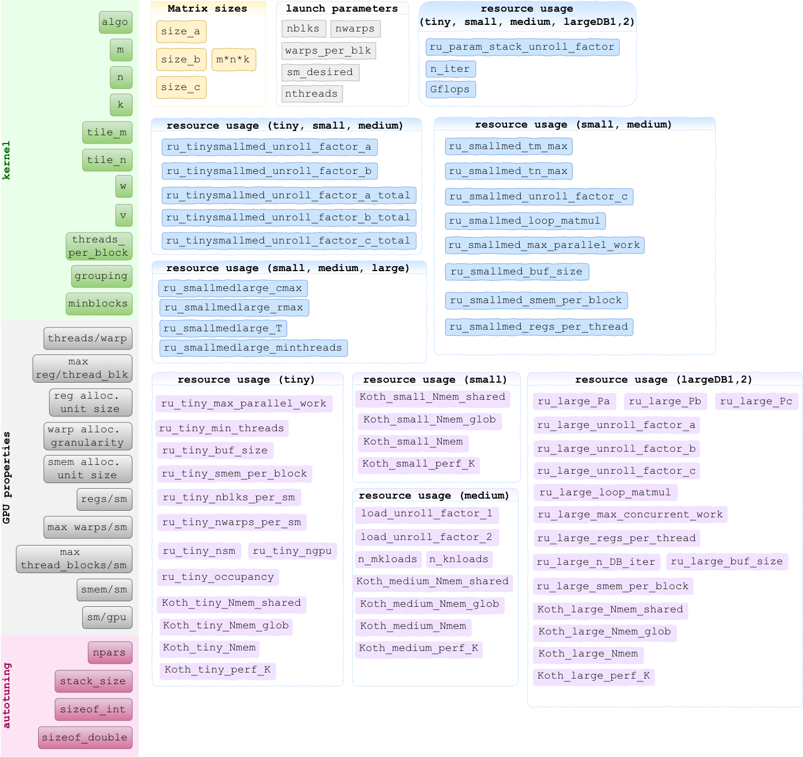

title: Kernel Parameters

# Kernel Parameters

## Batched Matrix-Matrix Multiplication Kernel Parameters

The batched matrix-matrix multiplication kernels are templated on:

* the characteristic dimensions of the multiplication: `m, n, k`
* between 3-7 kernel parameters from (`M`, `N`, `w`, `v`, `threads`, `grouping`, `minblocks`), depending on the algorithm.

## Batched Matrix Transpose Kernel Parameters

The batched transpose kernels are templated on:

* the characteristic dimensions of the transpose: `m, n`

## Predictive parameters

The input features for the predictive models can be 'raw' parameters (left-most-column in the figure below), or hand-engineered features 'derived' from the raw features (matrix sizes, launch parameters and resource usage estimations).

